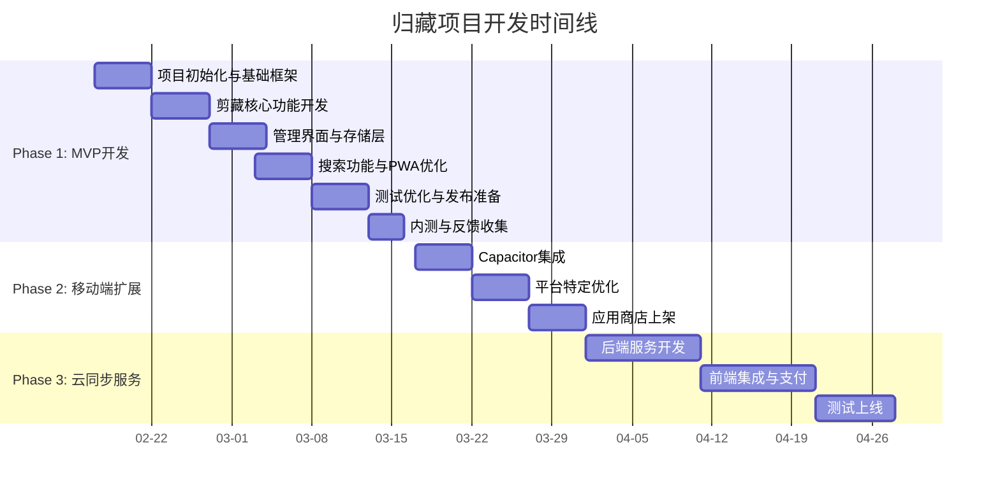

# 项目进度计划

## 项目概览
| 项目信息 | 值 |
|----------|----|
| **项目名称** | 归藏 (Guizhang) |
| **项目阶段** | Phase 1: MVP开发 |
| **计划周期** | 2026-02-17 至 2026-03-16 (4周) |
| **当前版本** | v1.0-alpha |
| **项目经理** | [待补充] |
| **技术负责人** | [待补充] |

## 总体时间线

### 里程碑计划


## 详细进度计划

### Week 1: 项目初始化与基础框架 (2026-02-17 ~ 2026-02-21)

#### 目标
- 完成项目基础框架搭建
- 实现网页抓取API核心功能
- 建立基本开发流程和规范

#### 详细任务
| 任务ID | 任务名称 | 负责人 | 开始日期 | 结束日期 | 状态 | 依赖 | 备注 |
|--------|----------|--------|----------|----------|------|------|------|
| TASK-101 | 项目脚手架搭建 | 开发 | 2026-02-17 | 2026-02-17 | 待开始 | - | Next.js + TypeScript + Tailwind CSS |
| TASK-102 | 开发环境配置 | 开发 | 2026-02-17 | 2026-02-17 | 待开始 | TASK-101 | ESLint、Prettier、Git Hooks |
| TASK-103 | 基础UI组件库配置 | 开发 | 2026-02-17 | 2026-02-18 | 待开始 | TASK-101 | shadcn/ui组件集成 |
| TASK-104 | 网页抓取API设计 | 开发 | 2026-02-18 | 2026-02-18 | 待开始 | TASK-101 | API路由设计，请求/响应格式 |
| TASK-105 | Readability集成 | 开发 | 2026-02-18 | 2026-02-19 | 待开始 | TASK-104 | 网页正文提取算法集成 |
| TASK-106 | HTML转Markdown实现 | 开发 | 2026-02-19 | 2026-02-19 | 待开始 | TASK-105 | turndown配置和自定义规则 |
| TASK-107 | 元数据提取功能 | 开发 | 2026-02-19 | 2026-02-20 | 待开始 | TASK-105 | 标题、作者、时间等元数据提取 |
| TASK-108 | 错误处理与重试机制 | 开发 | 2026-02-20 | 2026-02-20 | 待开始 | TASK-104~107 | 抓取失败处理，用户友好提示 |
| TASK-109 | API测试与文档 | 测试 | 2026-02-20 | 2026-02-21 | 待开始 | TASK-104~108 | API接口测试，文档编写 |
| TASK-110 | Week 1代码审查 | 开发 | 2026-02-21 | 2026-02-21 | 待开始 | 所有任务 | 代码质量检查，架构评审 |

#### 交付物
1. ✅ 可运行的Next.js项目
2. ✅ 网页抓取API（支持URL参数，返回Markdown）
3. ✅ 基础UI组件（按钮、输入框、卡片等）
4. ✅ 开发文档和API文档

#### 实际进度记录
| 任务ID | 任务名称 | 状态 | 实际开始 | 实际完成 | 实际工时 | 完成内容 | 问题与解决方案 |
|--------|----------|------|----------|----------|----------|----------|----------------|
| TASK-001 | Next.js项目初始化 | ✅ | 2026-02-17 | 2026-02-17 | 1.5h | 完成项目初始化，配置基础依赖 | 无 |
| TASK-002 | TypeScript配置 | ✅ | 2026-02-17 | 2026-02-17 | 1h | 配置tsconfig.json，启用严格模式 | 需要调整strict模式配置 |
| PRD-ENHANCE | PRD需求变动管理增强 | ✅ | 2026-02-24 | 2026-02-24 | 2h | 增强PRD更新流程，添加需求管理规则 | 无 |

#### 风险与依赖
- **风险**：Readability.js对某些网站支持不佳
- **缓解**：准备备选解析方案，支持手动编辑
- **依赖**：需要稳定的网络环境测试抓取功能

### Week 2: 剪藏核心功能开发 (2026-02-22 ~ 2026-02-26)

#### 目标
- 完成前端剪藏功能完整流程
- 实现本地数据存储层
- 构建基础用户界面

#### 详细任务
| 任务ID | 任务名称 | 负责人 | 开始日期 | 结束日期 | 状态 | 依赖 | 备注 |
|--------|----------|--------|----------|----------|------|------|------|
| TASK-201 | 剪藏界面设计 | 设计 | 2026-02-22 | 2026-02-22 | 待开始 | - | URL输入、预览、保存界面 |
| TASK-202 | URL输入组件开发 | 开发 | 2026-02-22 | 2026-02-23 | 待开始 | TASK-201 | URL验证、粘贴支持、历史记录 |
| TASK-203 | 剪藏状态管理 | 开发 | 2026-02-23 | 2026-02-23 | 待开始 | TASK-202 | 加载状态、进度提示、错误处理 |
| TASK-204 | 文章预览组件 | 开发 | 2026-02-23 | 2026-02-24 | 待开始 | TASK-201 | Markdown预览，元数据展示 |
| TASK-205 | IndexedDB存储设计 | 开发 | 2026-02-24 | 2026-02-24 | 待开始 | - | 数据库Schema设计，Dexie.js配置 |
| TASK-206 | 文章模型实现 | 开发 | 2026-02-24 | 2026-02-25 | 待开始 | TASK-205 | TypeScript类型定义，CRUD操作 |
| TASK-207 | 标签模型实现 | 开发 | 2026-02-25 | 2026-02-25 | 待开始 | TASK-205 | 标签数据结构，关联关系 |
| TASK-208 | 存储层集成测试 | 测试 | 2026-02-25 | 2026-02-25 | 待开始 | TASK-206~207 | 数据操作测试，边界条件处理 |
| TASK-209 | 剪藏完整流程集成 | 开发 | 2026-02-25 | 2026-02-26 | 待开始 | TASK-202~208 | 端到端剪藏功能测试 |
| TASK-210 | Week 2代码审查 | 开发 | 2026-02-26 | 2026-02-26 | 待开始 | 所有任务 | 功能完整性检查 |

#### 交付物
1. ✅ 完整的剪藏功能（URL→抓取→预览→保存）
2. ✅ 本地数据存储层（IndexedDB + Dexie.js）
3. ✅ 基础文章和标签数据模型
4. ✅ 用户友好的剪藏界面

#### 风险与依赖
- **风险**：IndexedDB兼容性问题
- **缓解**：测试主流浏览器，提供降级方案
- **依赖**：Week 1的API功能稳定

### Week 3: 管理界面与存储层 (2026-02-27 ~ 2026-03-03)

#### 目标
- 完成文章管理界面
- 实现标签管理系统
- 优化数据存储性能

#### 详细任务
| 任务ID | 任务名称 | 负责人 | 开始日期 | 结束日期 | 状态 | 依赖 | 备注 |
|--------|----------|--------|----------|----------|------|------|------|
| TASK-301 | 文章列表界面设计 | 设计 | 2026-02-27 | 2026-02-27 | 待开始 | - | 列表布局、卡片设计、操作按钮 |
| TASK-302 | 虚拟滚动列表实现 | 开发 | 2026-02-27 | 2026-02-28 | 待开始 | TASK-301 | 高性能列表，支持大量数据 |
| TASK-303 | 文章卡片组件开发 | 开发 | 2026-02-28 | 2026-02-28 | 待开始 | TASK-301 | 标题、摘要、标签、操作按钮 |
| TASK-304 | 分页与排序功能 | 开发 | 2026-02-28 | 2026-03-01 | 待开始 | TASK-302 | 按时间、标题排序，分页加载 |
| TASK-305 | 文章详情页面 | 开发 | 2026-03-01 | 2026-03-01 | 待开始 | - | 完整文章展示，Markdown渲染 |
| TASK-306 | 标签管理界面 | 设计 | 2026-03-01 | 2026-03-01 | 待开始 | - | 标签列表、创建、编辑、删除 |
| TASK-307 | 标签组件开发 | 开发 | 2026-03-01 | 2026-03-02 | 待开始 | TASK-306 | 标签显示、选择、颜色管理 |
| TASK-308 | 文章编辑功能 | 开发 | 2026-03-02 | 2026-03-02 | 待开始 | TASK-305 | 标题和内容编辑，保存历史 |
| TASK-309 | 删除与批量操作 | 开发 | 2026-03-02 | 2026-03-03 | 待开始 | TASK-303 | 单条删除，批量选择操作 |
| TASK-310 | 响应式设计优化 | 开发 | 2026-03-03 | 2026-03-03 | 待开始 | 所有界面任务 | 移动端适配，断点优化 |

#### 交付物
1. ✅ 文章列表页面（支持虚拟滚动、排序、分页）
2. ✅ 文章详情页面（Markdown渲染，编辑功能）
3. ✅ 标签管理系统（创建、编辑、删除、分配）
4. ✅ 响应式设计（适配桌面和移动端）

#### 风险与依赖
- **风险**：虚拟滚动性能问题
- **缓解**：使用成熟的虚拟滚动库，性能测试
- **依赖**：存储层数据读取性能

### Week 4: 搜索功能与PWA优化 (2026-03-04 ~ 2026-03-08)

#### 目标
- 实现全文搜索功能
- 完成PWA配置和优化
- 提升应用性能和用户体验

#### 详细任务
| 任务ID | 任务名称 | 负责人 | 开始日期 | 结束日期 | 状态 | 依赖 | 备注 |
|--------|----------|--------|----------|----------|------|------|------|
| TASK-401 | 搜索界面设计 | 设计 | 2026-03-04 | 2026-03-04 | 待开始 | - | 搜索框、结果列表、高亮显示 |
| TASK-402 | Fuse.js集成配置 | 开发 | 2026-03-04 | 2026-03-04 | 待开始 | - | 搜索索引配置，权重设置 |
| TASK-403 | 实时搜索功能 | 开发 | 2026-03-04 | 2026-03-05 | 待开始 | TASK-401~402 | 输入时实时搜索，防抖优化 |
| TASK-404 | 搜索结果高亮 | 开发 | 2026-03-05 | 2026-03-05 | 待开始 | TASK-403 | 关键词高亮显示，片段提取 |
| TASK-405 | Service Worker配置 | 开发 | 2026-03-05 | 2026-03-05 | 待开始 | - | 缓存策略，离线支持 |
| TASK-406 | Web App Manifest | 开发 | 2026-03-05 | 2026-03-06 | 待开始 | - | 应用元数据，安装引导 |
| TASK-407 | 离线功能测试 | 测试 | 2026-03-06 | 2026-03-06 | 待开始 | TASK-405~406 | 离线可用性，缓存更新 |
| TASK-408 | 性能优化 | 开发 | 2026-03-06 | 2026-03-07 | 待开始 | 所有功能 | 代码分割，图片优化，懒加载 |
| TASK-409 | 错误边界与监控 | 开发 | 2026-03-07 | 2026-03-07 | 待开始 | - | 错误捕获，用户友好提示 |
| TASK-410 | PWA安装引导 | 开发 | 2026-03-07 | 2026-03-08 | 待开始 | TASK-406 | 安装提示，使用引导 |

#### 交付物
1. ✅ 全文搜索功能（实时搜索，结果高亮）
2. ✅ PWA支持（Service Worker，可安装到桌面）
3. ✅ 性能优化（加载速度，内存使用）
4. ✅ 离线可用性（核心功能离线使用）

#### 风险与依赖
- **风险**：客户端搜索性能随数据量增长下降
- **缓解**：搜索索引优化，数据量过大时提示
- **依赖**：本地存储数据读取速度

### Week 5: 测试优化与发布准备 (2026-03-09 ~ 2026-03-13)

#### 目标
- 完成全面测试
- 优化用户体验
- 准备首次发布

#### 详细任务
| 任务ID | 任务名称 | 负责人 | 开始日期 | 结束日期 | 状态 | 依赖 | 备注 |
|--------|----------|--------|----------|----------|------|------|------|
| TASK-501 | 单元测试覆盖 | 测试 | 2026-03-09 | 2026-03-10 | 待开始 | 所有功能 | 核心功能单元测试 |
| TASK-502 | 集成测试 | 测试 | 2026-03-10 | 2026-03-10 | 待开始 | TASK-501 | 功能集成测试，端到端测试 |
| TASK-503 | 跨浏览器测试 | 测试 | 2026-03-10 | 2026-03-11 | 待开始 | - | Chrome、Safari、Firefox兼容性 |
| TASK-504 | 性能测试 | 测试 | 2026-03-11 | 2026-03-11 | 待开始 | - | Lighthouse评分，加载性能 |
| TASK-505 | 用户体验测试 | 设计 | 2026-03-11 | 2026-03-12 | 待开始 | - | 可用性测试，用户访谈 |
| TASK-506 | Bug修复与优化 | 开发 | 2026-03-12 | 2026-03-13 | 待开始 | TASK-501~505 | 根据测试结果修复问题 |
| TASK-507 | 文档完善 | 文档 | 2026-03-13 | 2026-03-13 | 待开始 | - | 用户指南，FAQ，帮助文档 |
| TASK-508 | 部署配置 | 运维 | 2026-03-13 | 2026-03-13 | 待开始 | - | 生产环境部署脚本 |
| TASK-509 | 发布清单检查 | 项目经理 | 2026-03-13 | 2026-03-13 | 待开始 | 所有任务 | 发布前最终检查 |
| TASK-510 | 内测版本发布 | 运维 | 2026-03-13 | 2026-03-13 | 待开始 | TASK-508~509 | 部署到生产环境 |

#### 交付物
1. ✅ 测试报告和Bug列表
2. ✅ 优化后的稳定版本
3. ✅ 完整的产品文档
4. ✅ 可访问的生产环境应用

#### 风险与依赖
- **风险**：测试发现重大架构问题
- **缓解**：预留缓冲时间，优先级修复
- **依赖**：所有前置功能基本完成

## 资源分配

### 人员配置（MVP阶段）
| 角色 | 人数 | 主要职责 | 时间投入 |
|------|------|----------|----------|
| **全栈开发** | 1 | 前后端开发，架构设计 | 100% |
| **UI/UX设计** | 0.5 | 界面设计，用户体验 | 50% |
| **测试** | 0.5 | 功能测试，质量保证 | 50% |
| **产品经理** | 0.5 | 需求管理，进度跟踪 | 50% |

### 工具与资源
| 资源 | 用途 | 状态 |
|------|------|------|
| **开发环境** | Node.js, VS Code, Git | 已准备 |
| **设计工具** | Figma, Adobe XD | 待准备 |
| **测试工具** | Jest, Playwright, Lighthouse | 待配置 |
| **部署环境** | Vercel/Netlify | 待配置 |
| **文档工具** | Notion, Markdown | 已准备 |

## 风险管理

### 技术风险
| 风险 | 概率 | 影响 | 缓解措施 | 责任人 |
|------|------|------|----------|--------|
| 网页抓取成功率低 | 中 | 高 | 多解析引擎备选，支持手动编辑 | 开发 |
| IndexedDB存储限制 | 低 | 中 | 数据清理策略，大小监控 | 开发 |
| PWA iOS兼容性问题 | 中 | 中 | Capacitor封装备选方案 | 开发 |
| 搜索性能随数据量下降 | 低 | 低 | 搜索优化，数据量提示 | 开发 |

### 项目风险
| 风险 | 概率 | 影响 | 缓解措施 | 责任人 |
|------|------|------|----------|--------|
| 需求变更频繁 | 中 | 中 | 明确需求范围，变更控制流程 | 产品经理 |
| 开发进度延迟 | 中 | 高 | 每周进度检查，风险早期识别 | 项目经理 |
| 测试资源不足 | 低 | 中 | 自动化测试，开发参与测试 | 测试 |
| 部署问题 | 低 | 低 | 提前部署测试，回滚方案 | 运维 |

## 沟通计划

### 例会安排
| 会议 | 频率 | 参与者 | 目的 | 产出 |
|------|------|--------|------|------|
| **每日站会** | 每日 | 开发团队 | 进度同步，问题反馈 | 每日任务清单 |
| **周进度会** | 每周 | 全体成员 | 进度汇报，风险识别 | 周报，问题清单 |
| **需求评审** | 按需 | 产品、开发、测试 | 需求澄清，技术评估 | 需求文档更新 |
| **发布评审** | 发布前 | 全体成员 | 发布准备检查 | 发布清单，发布计划 |

### 沟通渠道
| 渠道 | 用途 | 响应时间 |
|------|------|----------|
| **即时通讯** | 日常沟通，问题讨论 | 实时 |
| **项目管理工具** | 任务跟踪，进度管理 | 每日更新 |
| **文档系统** | 需求文档，技术文档 | 持续更新 |
| **代码仓库** | 代码管理，版本控制 | 持续集成 |

## 质量保证

### 质量标准
| 质量维度 | 标准 | 测量方法 |
|----------|------|----------|
| **功能完整性** | 所有P0需求实现 | 需求跟踪矩阵 |
| **代码质量** | 代码覆盖率 > 80% | 单元测试报告 |
| **性能** | Lighthouse评分 > 90 | 性能测试报告 |
| **兼容性** | 支持目标浏览器 | 跨浏览器测试报告 |
| **用户体验** | 用户测试满意度 > 4/5 | 用户测试反馈 |

### 测试策略
| 测试类型 | 范围 | 工具 | 执行者 |
|----------|------|------|--------|
| **单元测试** | 核心函数，工具类 | Jest, Vitest | 开发 |
| **集成测试** | 功能模块集成 | Playwright | 测试 |
| **端到端测试** | 完整用户流程 | Playwright | 测试 |
| **性能测试** | 加载速度，内存使用 | Lighthouse | 测试 |
| **兼容性测试** | 多浏览器测试 | BrowserStack | 测试 |

## 变更管理

### 变更流程
1. **变更申请**：填写变更申请单，说明变更内容和理由
2. **影响评估**：评估对进度、成本、质量的影响
3. **审批决策**：项目负责人审批变更
4. **文档更新**：更新`docs/PRD.md`和相关文档，记录变更
5. **实施跟踪**：更新计划，跟踪实施情况
6. **验证关闭**：验证变更效果，关闭变更请求

### 变更控制委员会
| 角色 | 职责 |
|------|------|
| **产品负责人** | 业务需求变更审批 |
| **技术负责人** | 技术方案变更审批 |
| **项目经理** | 进度和资源变更管理 |

## 附录

### 项目状态报告模板
```markdown
# 项目周报 - 第X周 (YYYY-MM-DD)

## 本周总结
- 完成工作
- 遇到的问题
- 下周计划

## 进度跟踪
| 模块 | 计划进度 | 实际进度 | 偏差 | 备注 |
|------|----------|----------|------|------|

## 风险与问题
| 项目 | 状态 | 影响 | 应对措施 |
|------|------|------|----------|

## 下周计划
1. 主要任务
2. 交付物
3. 所需支持
```

### 重要联系人
| 角色 | 姓名 | 联系方式 | 职责 |
|------|------|----------|------|
| 产品负责人 | [待补充] | | 需求决策，产品方向 |
| 技术负责人 | [待补充] | | 技术架构，开发管理 |
| 项目经理 | [待补充] | | 进度管理，风险控制 |
| 开发负责人 | [待补充] | | 开发实施，技术问题 |

---

**文档状态**：草案
**下次评审日期**：2026-02-20
**批准签字**：
- 产品负责人：___________________
- 技术负责人：___________________
- 项目经理：___________________

## 进度更新指南

### 更新原则
- **每次完成一个任务就更新进度**：确保进度文档反映最新状态
- **状态同步**：保持`PROGRESS.md`和`TASKS.md`状态一致
- **详细记录**：记录实际工时、完成内容、遇到的问题

### 更新步骤
1. **任务完成后**：立即更新`TASKS.md`中的任务状态
2. **更新进度**：在`PROGRESS.md`的相应周计划中更新进度
3. **记录详情**：记录实际工时、开始/完成时间、完成内容
4. **问题记录**：记录遇到的问题和解决方案
5. **下一步计划**：更新后续任务计划

### 状态标记说明
- ✅ 完成 - 任务已完成并通过验收
- 🔄 进行中 - 任务正在进行中
- ⏸️ 暂停 - 任务暂时停止
- ❌ 取消 - 任务已取消

### 进度更新示例
```markdown
#### 实际进度记录
| 任务ID | 任务名称 | 状态 | 实际开始 | 实际完成 | 实际工时 | 完成内容 | 问题与解决方案 |
|--------|----------|------|----------|----------|----------|----------|----------------|
| TASK-001 | Next.js项目初始化 | ✅ | 2026-02-17 | 2026-02-17 | 1.5h | 完成项目初始化，配置基础依赖 | 无 |
| TASK-002 | TypeScript配置 | ✅ | 2026-02-17 | 2026-02-17 | 1h | 配置tsconfig.json，启用严格模式 | 需要调整strict模式配置 |
```